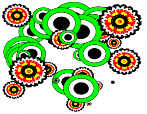
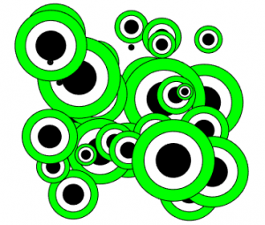
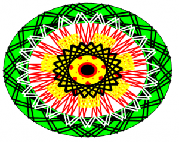
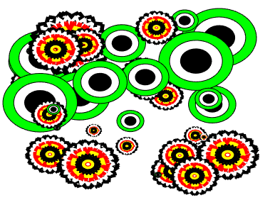

## Matlab-CreativeArt

While working with complex I/Q data from radio signals, some of graphic plots ended up being pieces of an art work by accident. So, it might be worth sharing it with you. Matlab is a powerful software that is used in various fields such as engineering, mathematics, economics, automation systems. It has a rich set of libraries for signal processing and data visualization. Though Matlab’s graphics engine is not meant for high quality artwork, it is fun to play with it. 

Here are sample outputs.

  
  
  
  

If you are serious artist, however, I recommend you to check other softwares such as [Processing](https://processing.org/) and [Cinder](https://libcinder.org/) which are platforms for professional creative artwork design.

